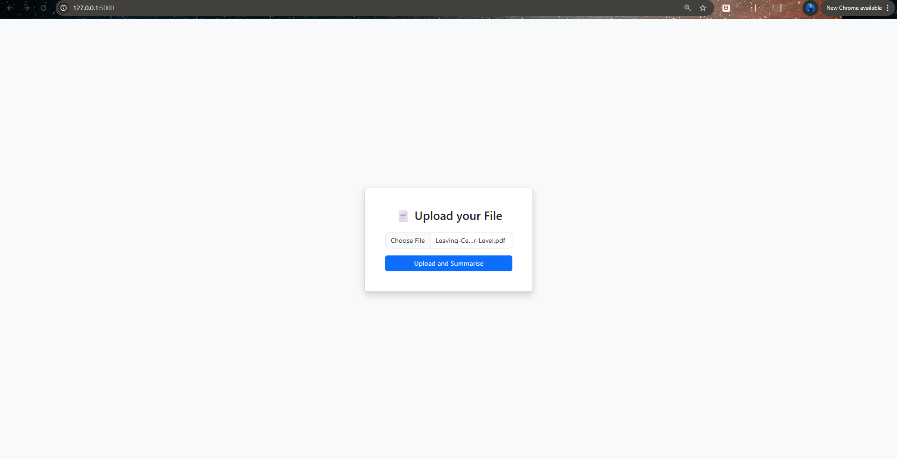
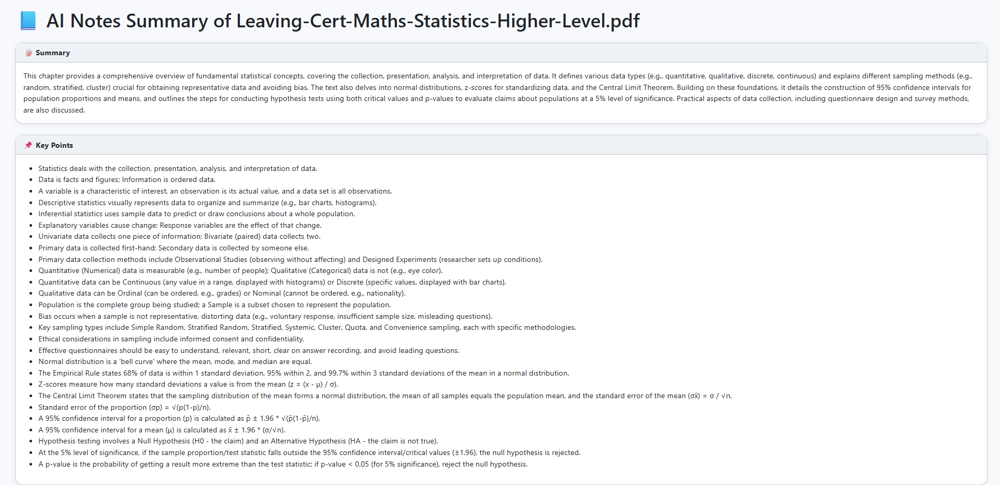
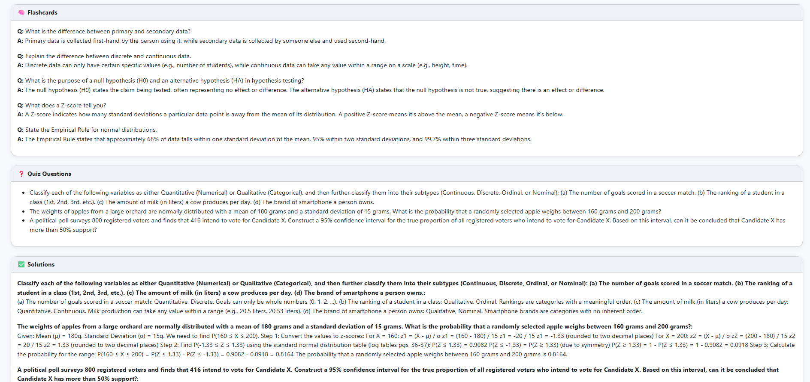
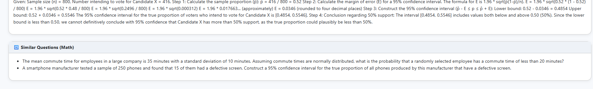

# Notes Summariser

This project is a simple and efficient tool to summarise notes from PDFs and images. It extracts text and images, processes them, and generates concise summaries using the Gemini API. It’s designed to help students save time and focus on the key points in their study materials.

## File Structure

Here’s a quick overview of how the project is organised:

- **app.py**  
  The main Flask application that handles routing, file uploads, and interacts with the summarisation logic.

- **uploads/**  
  This folder is where all uploaded files are temporarily stored. Inside it, there’s an `images/` folder that holds images extracted from documents.

- **templates/**  
  Contains HTML templates used to render the web pages.

- **static/**  
  Holds static assets like CSS, JavaScript, and any client-side images.

- **.env**  
  Stores environment variables like the Gemini API key. *(Note: this file is kept out of version control for security.)*

- **requirements.txt**  
  Lists the Python dependencies needed to run the app.

  In order to run the app, make sure to change credentials as per your computer (i.e. in gemini_class include your own api_key and change the uploads_folder path to the path relevant to your system

## Images Showcase
These are a couple of pictures of how the app looks

Explore the code and try out this app if you'd like too!

— Sanidhya Arora
